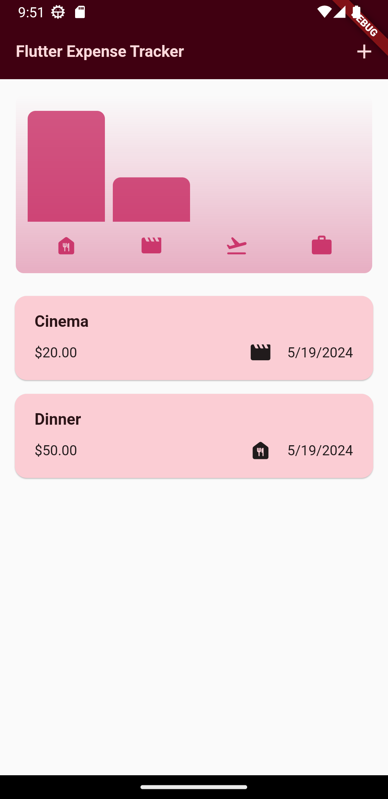
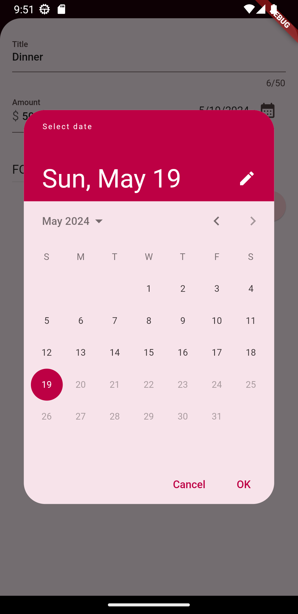
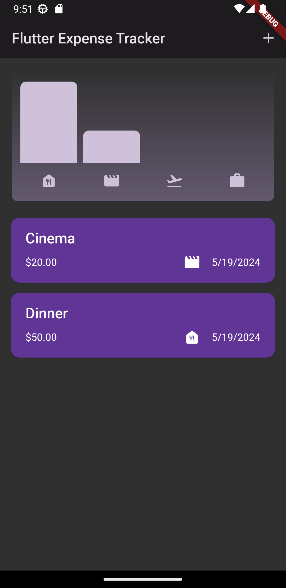
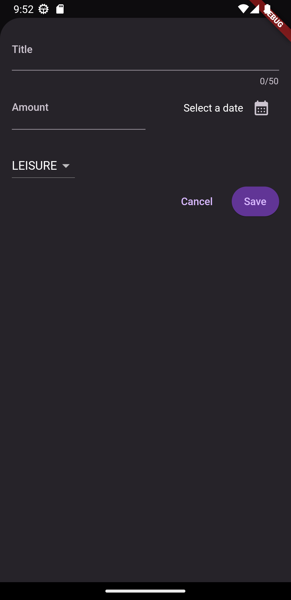
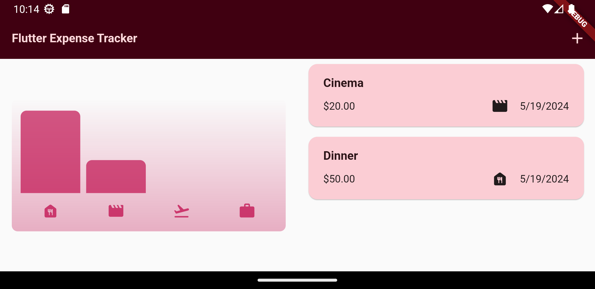
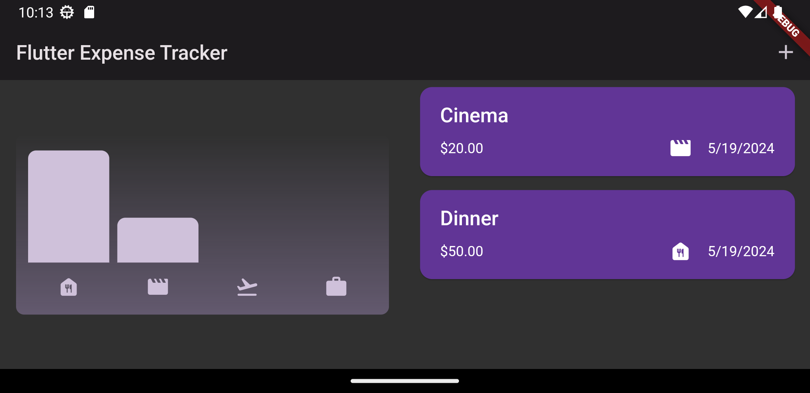

# Expense Tracker App

Welcome to the Expense Tracker App repository! This Flutter-based mobile application helps users track their expenses efficiently and visualize their spending patterns through categorized bar charts.

## Features

- **Add Expense Entries:** Quickly add new expense entries with a simple and intuitive form. Note that entries are non-editable to maintain data integrity.
- **Visualize Expenses:** Bar chart representation of expenses per category for easy analysis.
- **Smooth User Interface:** Implemented using ListView, ListView.builder, and Dismissible widgets for a seamless user experience.
- **User Feedback:** Instant feedback with Snackbar and a modal bottom sheet for smooth data input.
- **Cross-Platform Support:** Uses platform-specific dialogs (AlertDialog for Android and CupertinoDialog for iOS).
- **Input Validation:** Ensures accurate data entry with robust validation.
- **Interactive Forms:** Dropdowns, TextFields, and DatePicker for comprehensive expense entry.
- **Dynamic Theming:** Switch between light and dark modes using SeedColor.
- **Responsive Design:** Adaptive layout for various screen sizes and orientations.

# Portrait Screenshots

## Light Mode

<p align="center">
  
  
  
</p>

## Dark Mode

<p align="center">
  
  
</p>

# Landscape Screenshots

<p align="center">
  
  
</p>

## Installation

1. **Clone the repository:**

   ```bash
   git clone https://github.com/TerminalWarlord/Expense-Tracker-App.git
   cd Expense-Tracker-App
   ```

2. **Install dependencies:**

   ```bash
   flutter pub get
   ```

3. **Run the app:**
   ```bash
   flutter run
   ```

## Usage

1. Open the app on your device.
2. Add a new expense entry by tapping the add button.
3. Fill in the details including the amount, category, and date.
4. View your expenses categorized in a bar chart on the main screen.

## Technologies Used

- **Flutter:** Framework for building natively compiled applications for mobile from a single codebase.
- **Dart:** Programming language optimized for building mobile, desktop, server, and web applications.
- **ListView & ListView.builder:** For displaying a scrollable list of widgets.
- **Dismissible:** For swipe-to-dismiss functionality.
- **Snackbar:** For displaying brief messages at the bottom of the screen.
- **Modal Bottom Sheet:** For showing a modal bottom sheet to collect user input.
- **SingleChildScrollView:** For making the app responsive and scrollable.
- **AlertDialog & CupertinoDialog:** For showing alerts on Android and iOS respectively.
- **DatePicker:** For selecting dates conveniently.
- **SeedColor:** For dynamic theming.

## Contributing

Contributions are welcome! Please fork this repository and submit a pull request with your changes. Ensure you follow the contribution guidelines.

## License

This project is licensed under the MIT License. See the [LICENSE](LICENSE) file for more details.

## Contact

If you have any questions or suggestions, feel free to open an issue or contact me directly.
